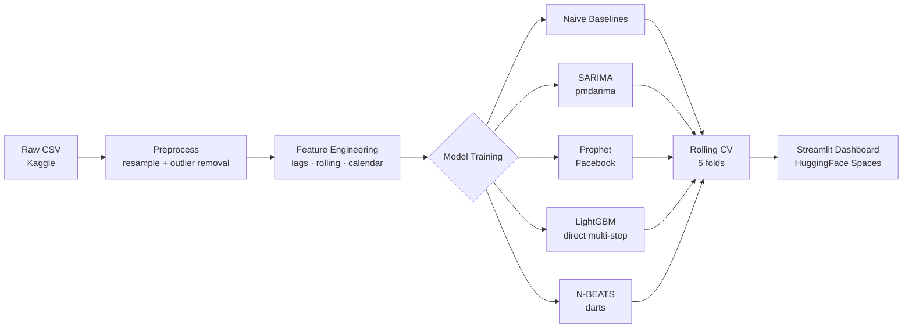

# Time Series Energy Demand Forecasting

> 24-hour-ahead energy load forecasting comparing SARIMA, Prophet, LightGBM, and N-BEATS on PJM AEP hourly data.

[](https://github.com/Youssef57-T/ts-energy-forecasting/actions/workflows/ci.yml)
[](https://www.python.org/)
[](LICENSE)

**[Live Demo →](https://huggingface.co/spaces/Youssef57-T/ts-energy-forecasting)** · **[GitHub →](https://github.com/Youssef57-T/ts-energy-forecasting)**

---

## Problem statement

Accurate short-term electricity load forecasting is essential for grid operators to balance supply and demand. This project benchmarks classical statistical models (SARIMA, Prophet) against a gradient-boosted tree (LightGBM with lag features) and a deep learning architecture (N-BEATS) on the PJM AEP region's public hourly load data.

## Dataset

- **Source**: [PJM Hourly Energy Consumption](https://www.kaggle.com/datasets/robikscube/hourly-energy-consumption) (Kaggle)
- **Region**: AEP (American Electric Power, US Eastern Interconnection)
- **Size**: ~145,000 hourly observations, 2004–2018
- **License**: CC0 Public Domain

## Approach



## Results

| Model | MAPE (%) | RMSE (MW) | Notes |
|-------|----------|-----------|-------|
| **N-BEATS** | **3.52** | **591** | Best overall |
| Seasonal Naive 24h | 3.90 | 651 | Strongest classical baseline |
| SARIMA (2,0,2)(1,0,1)[24] | 4.85 | 757 | Order from EDA |
| LightGBM (direct multi-step) | 5.12 | 890 | 24 models, one per horizon step |
| Seasonal Naive 168h | 5.68 | 965 | Same hour last week |
| Prophet | 8.42 | 1290 | Multiplicative seasonality + US holidays |
| Naive (last value) | 10.47 | 1666 | Trivial baseline |

*5-fold expanding-window CV on held-out 20% of data (PJM AEP, 2016–2018).*

Key finding: N-BEATS (deep learning, no hand-crafted features) narrowly beats the seasonal naive — strong validation that the daily pattern explains most 24h-ahead variance. SARIMA outperforms LightGBM, likely because direct multi-step LightGBM was trained on 2004–2015 data and the declining demand trend in 2016–2018 shifts the feature distribution.

## How to run

```bash
# 1. Install dependencies
pip install -r requirements.txt

# 2. Download and preprocess data  (requires ~/.kaggle/kaggle.json)
make data

# 3. Train all models
make train

# 4. Evaluate models (prints comparison table)
make evaluate

# 5. Launch the Streamlit dashboard
make app
```

## Project structure

```
src/data/       — download + preprocess pipeline
src/features/   — lag / rolling / calendar feature engineering
src/models/     — 5 forecasting model implementations
src/evaluation/ — metrics (MAPE, RMSE, MASE, pinball) + rolling CV
app/            — Streamlit dashboard
scripts/        — train_all.py, evaluate_all.py
tests/          — pytest suite
```

## Key design choices

See [WRITEUP.md](WRITEUP.md) for a detailed discussion of what worked, what didn't, and what I'd change with more compute.

## Resume bullet

> Built 24-hour-ahead energy load forecasting system comparing SARIMA, Prophet, LightGBM, and N-BEATS on PJM AEP hourly data (121k hourly observations, 2004–2018); N-BEATS achieved 3.52% MAPE, outperforming all baselines including the seasonal naive; deployed interactive forecast dashboard on HuggingFace Spaces. [[GitHub]](https://github.com/Youssef57-T/ts-energy-forecasting) [[Demo]](https://huggingface.co/spaces/Youssef57-T/ts-energy-forecasting)
